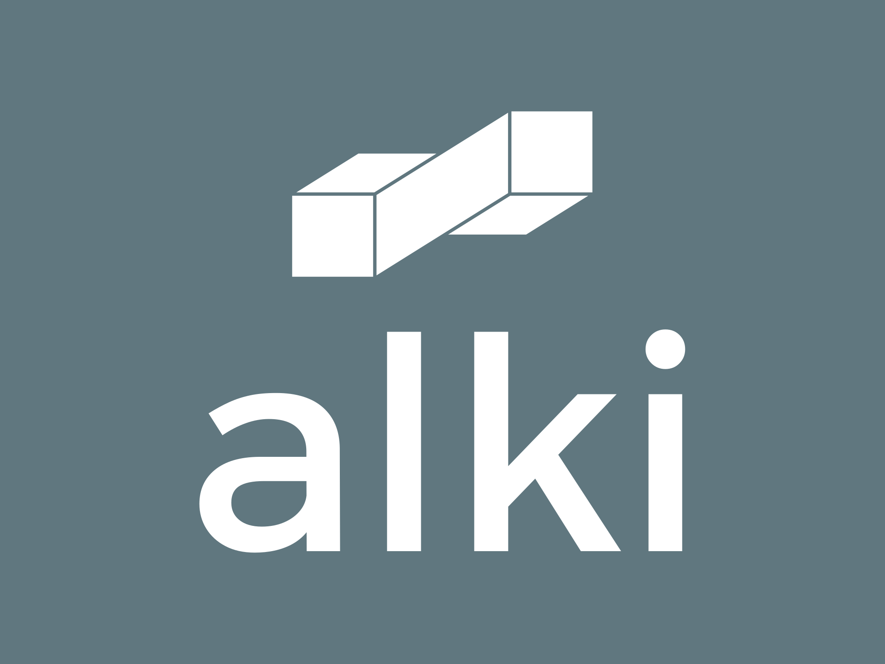

# Alki: Master LeetCode Through the Power of Spaced Repetition

_Alki - Mastering Algorithms, Securing Your Future through Science-Based Learning_

## 🚫 Say Goodbye to Inefficient Practices

Are you still relying on spreadsheets and manual tracking for your LeetCode practice? It's time for an upgrade:

- ❌ No more endless Excel sheets with long lists of problems
- ❌ No more manual calculation of review times
- ❌ No more disorganized practice routines
- ❌ No more ineffective long-term retention strategies

Alki revolutionizes your prep by addressing these pain points head-on!

## 🧠 The Science of Remembering: Spaced Repetition

Alki harnesses the power of spaced repetition, a learning technique scientifically proven to enhance long-term memory retention. It is also a technique used by medical students and professionals all around the world! Here's why it's game-changing for mastering LeetCode problems:

1. **Fight the Forgetting Curve**: Our brains naturally forget information over time. Spaced repetition counteracts this by reviewing material at increasing intervals, solidifying knowledge in your long-term memory.

2. **Efficient Learning**: Instead of wasteful cramming, Alki optimizes your study schedule, ensuring you review problems at the perfect moment – not too soon, not too late.

3. **Personalized to Your Brain**: Everyone's memory works differently. Alki adapts to your individual retention rates, creating a truly personalized learning experience.

4. **Confidence in Interviews**: By systematically reinforcing your knowledge, you'll walk into coding interviews with solutions fresh in your mind, ready to tackle any problem with ease.

## 🌟 What is Alki?

Alki, derived from "algorithm" and "Anki," is your key to mastering LeetCode problems and acing tech interviews. The name also carries a deeper meaning - "Alki" is a Chinook word meaning "in the future," perfectly encapsulating our mission to secure your future in tech through effective, science-based learning.

## 🚀 Supercharge Your Interview Prep

Say goodbye to forgetting solutions and hello to long-term retention of problem-solving strategies!

### 🧠 Smart Spaced Repetition System

Never forget a problem again! The SM2 algorithm calculates the perfect time for you to review each problem, ensuring maximum retention with minimum effort.

### 📊 Personalized Learning Path

Tailor your practice to your needs. Alki adapts to your learning pace and focuses on your weak areas, making every minute of practice count.

### 🎯 Optimized Daily Practice

Stay motivated with scientifically-scheduled problem suggestions. Build a consistent habit that leverages spaced repetition for optimal learning.

### 📁 Intuitive Organization

Efficiently manage and categorize solved problems. No more scrolling through endless spreadsheet rows!

## 🌟 Key Features

- **Smart Problem Tracking**: Automatically log and organize the problems you've solved.
- **Optimal Review Scheduler**: Get notifications for problems you need to revisit at the perfect time, based on spaced repetition principles.
- **Progress Dashboard**: Visualize your improvement and memory retention with intuitive charts and statistics.
- **Customizable Study Plans**: Create and adjust your study schedule to fit your goals and timeline, all while adhering to spaced repetition best practices.
- **Problem Recommendations**: Receive tailored problem suggestions based on your performance, goals, and optimal review timings.

## 💎 Future Premium Features

We're working on exciting premium features to unlock the full potential of Alki:

- **Advanced Analytics**: Dive deep into your performance data and memory retention rates.
- **Concept Videos**: Access exclusive tutorial videos on complex algorithms and data structures, integrated with your spaced repetition schedule.
- **Custom Algorithm Tweaking**: Fine-tune the spaced repetition algorithm to match your unique learning style and memory patterns.
- **Priority Support**: Get your questions answered quickly by our dedicated support team.

## 🚀 Getting Started

1. Sign up at [www.alkiprep.com](https://www.alkiprep.com)
2. Start adding solved problems
3. Set your study goals and preferences
4. Let Alki guide your daily practice with scientifically-optimized review sessions

Start your journey to interview success today!

## 💬 Join Our Community

Be part of the Alki community and share your progress:

_Links to be added later_

## 🤝 Support

Need help? Our support team is here for you:

- 📧 Email:
- 💬 Live Chat: Available on our website
- 📚 FAQ: [www.alkiprep.com/faq](https://www.alkiprep.com/faq)

## 🔒 Security

Your data is safe with us. Alki uses state-of-the-art encryption to protect your information and practice history.

---

Ready to transform your coding interview preparation with the power of spaced repetition? [Sign up now](https://www.alkiprep.com/signup) and take the first step towards your dream tech job!

_Alki - Mastering Algorithms, Securing Your Future through Science-Based Learning_
